# ESP32 Adaptive Sampling IoT System

Individual IoT assignment implementation using a `Heltec WiFi LoRa 32 V3`, `ESP-IDF`, and `FreeRTOS`.

This project builds an IoT node that generates a virtual sensor signal, samples it, analyzes it locally with an FFT, adapts the sampling frequency, computes a `5 s` aggregate, sends the aggregate to a nearby edge server over `MQTT/WiFi`, and sends the same aggregate to the cloud through `LoRaWAN + TTN`.

## Table Of Contents

- [Overview](#overview)
- [Assignment Coverage](#assignment-coverage)
- [System Architecture](#system-architecture)
- [Design Rationale](#design-rationale)
- [Code Organization](#code-organization)
- [Important Functions](#important-functions)
- [Implementation Details](#implementation-details)
- [Performance Evaluation](#performance-evaluation)
- [Evidence Gallery](#evidence-gallery)
- [Setup And Run](#setup-and-run)
- [How To Reproduce Key Claims](#how-to-reproduce-key-claims)
- [Presentation Walkthrough](#presentation-walkthrough)
- [Likely Evaluation Questions](#likely-evaluation-questions)
- [Submission Notes](#submission-notes)

## Overview

The input signal follows the assignment model:

```text
s(t) = 2*sin(2*pi*3*t) + 4*sin(2*pi*5*t)
```

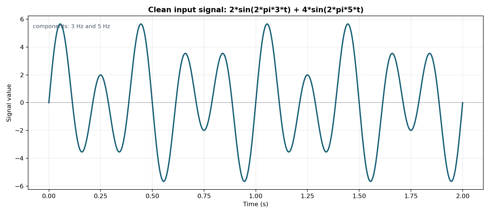

The firmware detects the `5 Hz` dominant component and adapts the sampling rate from the fixed baseline `50 Hz` to the optimized steady-state rate `40 Hz` using an `8x` oversampling policy.

Main features:

- FreeRTOS task pipeline for sampling, processing, control, communication, metrics, and display.
- Raw maximum sampling benchmark measured at `199,126.59 Hz`.
- FFT-based dominant-frequency detection.
- Adaptive sampling from `50 Hz` to `40 Hz`.
- Window average over `5 s`.
- MQTT edge delivery with saved listener logs and latency summaries.
- Secure MQTT validation over `MQTTS` with TLS certificate verification.
- LoRaWAN + TTN uplink proof with serial and TTN screenshots.
- INA219 energy comparison for baseline, adaptive, and adaptive + deep sleep.
- Three signal profiles and extended anomaly-filter evaluation.

## Assignment Coverage

| Requirement | Result | Evidence |
| --- | --- | --- |
| Maximum sampling frequency | Raw benchmark: `199,126.59 Hz`; strict full-pipeline baseline: `50 Hz` | [`source/pics/Sampling_frequency.png`](./source/pics/Sampling_frequency.png), [`source/docs/CURRENT_PROGRESS_REPORT.md`](./source/docs/CURRENT_PROGRESS_REPORT.md) |
| Optimal sampling frequency | Dominant `5 Hz`, adaptive rate `40 Hz` | [`source/pics/2026-04-18_better_serial_plotter_live_view.png`](./source/pics/2026-04-18_better_serial_plotter_live_view.png) |
| Aggregate over window | `5 s` window average computed and propagated to MQTT and LoRaWAN | [`source/results/runtime_notes_2026-04-17.md`](./source/results/runtime_notes_2026-04-17.md) |
| MQTT over WiFi | Real Heltec board published aggregate messages to the edge listener | [`source/results/mqtt_evidence_2026-04-18.md`](./source/results/mqtt_evidence_2026-04-18.md), [`source/results/wifi_mqtt_evidence_2026-04-21.md`](./source/results/wifi_mqtt_evidence_2026-04-21.md) |
| LoRaWAN + TTN | Integrated main app joined and sent uplinks to TTN | [`source/results/lorawan_evidence_2026-04-20.md`](./source/results/lorawan_evidence_2026-04-20.md) |
| Energy saving | Adaptive awake run: `-0.06%`; optional deep sleep: `-26.04%` | [`source/results/summaries/ina219_comparison_2026-04-21.md`](./source/results/summaries/ina219_comparison_2026-04-21.md) |
| Communication volume | Represented samples drop `20%`; aggregate MQTT bytes stay flat | [`source/results/summaries/communication_volume_comparison_2026-04-21.md`](./source/results/summaries/communication_volume_comparison_2026-04-21.md) |
| End-to-end latency | Saved synchronized MQTT listener run | [`source/results/summaries/mqtt_summary_2026-04-18_listener.md`](./source/results/summaries/mqtt_summary_2026-04-18_listener.md) |
| Three input signals | `clean_reference`, `noisy_reference`, `anomaly_stress` | [`source/pics/input_signal_profiles_2026-04-22.png`](./source/pics/input_signal_profiles_2026-04-22.png), [`source/results/final_evidence_index_2026-04-21.md`](./source/results/final_evidence_index_2026-04-21.md) |
| Anomaly filters bonus | Z-score and Hampel evaluated at `p=1%, 5%, 10%` | [`source/results/summaries/anomaly_filter_evaluation_2026-04-21.md`](./source/results/summaries/anomaly_filter_evaluation_2026-04-21.md) |
| Secure MQTT | Real Heltec board published aggregates over `MQTTS` to `broker.emqx.io:8883`; listener used TLS with certificate verification required | [`source/results/secure_mqtt_evidence_2026-04-22.md`](./source/results/secure_mqtt_evidence_2026-04-22.md), [`source/docs/SECURE_MQTT_SETUP.md`](./source/docs/SECURE_MQTT_SETUP.md) |

## System Architecture

```text
virtual signal
    -> sampling task
    -> FFT / dominant-frequency detection
    -> adaptive sampling controller
    -> 5 s aggregate window
    -> MQTT/WiFi edge server
    -> LoRaWAN/TTN cloud uplink
```

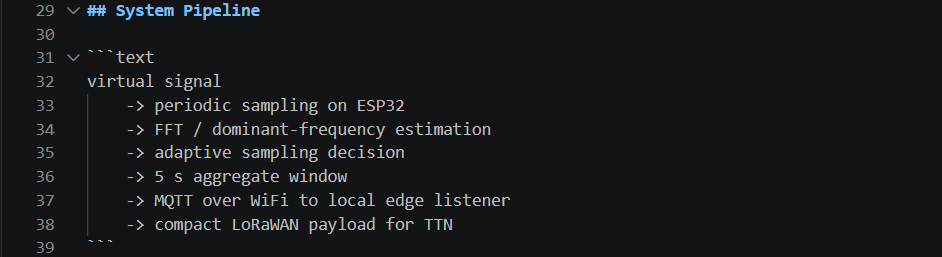

FreeRTOS task pipeline used in the firmware:

```text
app_main()
  creates queues, event bits, shared project_context_t
  starts the FreeRTOS tasks below

signal_input_task
  generates virtual samples:
  2*sin(2*pi*3*t) + 4*sin(2*pi*5*t)
        |
        | sample_queue
        v
signal_processing_task
  builds a 5 s window
  computes average value
  computes DFT/FFT-style spectral bins
  finds dominant frequency = 5 Hz
        |
        | fft_queue
        v
sampling_control_task
  applies adaptive policy:
  new_fs = dominant_frequency * 8
  5 Hz * 8 = 40 Hz
        |
        | updates shared current_sampling_frequency_hz
        +--------------------------------------+
                                               |
                                               v
                                  signal_input_task uses 40 Hz

signal_processing_task also sends the same aggregate to:

  aggregate_mqtt_queue              aggregate_lorawan_queue
        |                                      |
        v                                      v
  comm_mqtt_task                    comm_lorawan_task
  JSON over MQTT/MQTTS              compact LoRaWAN payload
        |                                      |
        v                                      v
  edge MQTT listener                TTN Live Data

metrics_task + app_display_task
  print heartbeats, counters, timings, latest fs, dominant frequency, and average

app_main supervisor loop
  checks queue status, event bits, communication counters, and optional deep sleep
```

Hardware used:

| Component | Purpose |
| --- | --- |
| `Heltec WiFi LoRa 32 V3` | Device under test running the main FreeRTOS firmware |
| `INA219` | Current and power measurement |
| second ESP32 or Heltec | INA219 monitor board |
| laptop | PlatformIO build, serial monitor, Mosquitto broker, MQTT listener |
| TTN console | LoRaWAN cloud validation |

## Design Rationale

These are the main design decisions and the short explanation to use if asked during evaluation.

| Decision | Why it was used |
| --- | --- |
| Virtual sensor instead of an external analog sensor | The assignment defines the required input as a mathematical signal. Generating it in firmware makes the `3 Hz + 5 Hz` input repeatable, avoids ADC wiring noise, and lets every run be compared fairly. |
| Raw max benchmark plus strict full-pipeline baseline | The raw benchmark answers "how fast can the board generate samples?" and reached `199,126.59 Hz`. The strict `50 Hz` baseline answers "what stable rate can the full FreeRTOS pipeline run with FFT, queues, MQTT, LoRaWAN, metrics, and display enabled?" |
| Adaptive target of `40 Hz` for a `5 Hz` dominant signal | A `2x` Nyquist rate would be the theoretical minimum, but this implementation uses an `8x` oversampling policy for practical margin, stable FFT windows, and cleaner real-time scheduling on the ESP32. |
| One aggregate per `5 s` window | The edge and cloud receive useful summaries instead of raw samples. This directly reduces communication overhead compared with transmitting every sample. |
| Same aggregate for MQTT and LoRaWAN | The system computes one result and then sends it through two communication paths: JSON over MQTT and compact binary over LoRaWAN. |
| Secure MQTT tested separately from local MQTT | Local MQTT proves the edge pipeline in the lab. Secure MQTT proves the transport security requirement with `MQTTS`, TLS verification, and certificate validation. |
| Energy measured with an external INA219 monitor | The INA219 measures real board power instead of estimating from code. The same DUT, monitor, signal, and run duration were used for baseline and adaptive runs. |
| Deep sleep reported separately | Deep sleep gives the large energy reduction, but it is a duty-cycle optimization. The required adaptive-sampling comparison is still reported honestly in awake mode. |

## Code Organization

```text
source/
  firmware/esp32_node/        final ESP32 FreeRTOS firmware
  firmware/ina219_power_monitor/
                               second-board INA219 monitor firmware
  edge_server/mqtt_listener/  local MQTT listener and logger
  cloud/ttn_payloads/         TTN payload decoder and notes
  docs/                       reports, runbooks, setup notes
  results/                    saved CSV/JSON/Markdown measurements
  pics/                       screenshots and hardware photos
```

Most important files:

| Path | Purpose |
| --- | --- |
| [`source/firmware/esp32_node/main/app_main.c`](./source/firmware/esp32_node/main/app_main.c) | FreeRTOS task creation and supervision |
| [`source/firmware/esp32_node/components/signal_input/`](./source/firmware/esp32_node/components/signal_input/) | virtual signal generation and benchmarks |
| [`source/firmware/esp32_node/components/signal_processing/`](./source/firmware/esp32_node/components/signal_processing/) | FFT, windowing, aggregate generation |
| [`source/firmware/esp32_node/components/comm_mqtt/`](./source/firmware/esp32_node/components/comm_mqtt/) | WiFi and MQTT publishing |
| [`source/firmware/esp32_node/components/comm_lorawan/`](./source/firmware/esp32_node/components/comm_lorawan/) | compact LoRaWAN payload and Heltec radio integration |
| [`source/firmware/ina219_power_monitor/src/main.cpp`](./source/firmware/ina219_power_monitor/src/main.cpp) | INA219 monitor output |
| [`source/results/final_evidence_index_2026-04-21.md`](./source/results/final_evidence_index_2026-04-21.md) | map of evidence to assignment requirements |

FreeRTOS task responsibilities:

| Task/module | Responsibility | Output |
| --- | --- | --- |
| `signal_input` | Generates the virtual signal at the current sampling frequency | sample queue |
| `signal_processing` | Buffers each `5 s` window, computes FFT peaks, and creates aggregates | aggregate queues |
| `sampling_control` | Applies the adaptive policy from dominant frequency to sampling rate | runtime sampling update |
| `comm_mqtt` | Connects WiFi, synchronizes time, and publishes aggregate JSON | MQTT broker / edge listener |
| `comm_lorawan` | Packs compact aggregate payloads and uses the Heltec radio stack | TTN uplink |
| `metrics` | Tracks timing, counters, latency-related fields, and heartbeats | serial metrics logs |
| `app_display` | Emits simple serial/display status for live observation | serial/display heartbeat |

The important code idea is that tasks do not call each other directly. They communicate through FreeRTOS queues stored in the shared `project_context_t`:

```text
sample_queue -> fft_queue -> adaptive update
             -> aggregate_mqtt_queue -> mqtt_queue -> MQTT broker
             -> aggregate_lorawan_queue -> lorawan_queue -> TTN
```

`app_main()` creates the queues, starts the tasks, and then stays alive as a supervisor. It logs queue depth, event bits, sample counts, window counts, MQTT/LoRa counters, current sampling rate, dominant frequency, and latest average. That is why the serial logs are useful for proving the runtime behavior.

## Important Functions

This section maps the main assignment requirements to the exact functions in the code. It is useful during the presentation when asked "where did you implement this?"

### Main ESP32 Firmware

| Requirement / feature | Function | Goal |
| --- | --- | --- |
| FreeRTOS startup | [`app_main()`](./source/firmware/esp32_node/main/app_main.c#L223) | Boots the firmware, initializes every module, creates all FreeRTOS tasks, then runs the supervisor loop. |
| Shared queues and state | [`project_context_create()`](./source/firmware/esp32_node/main/app_main.c#L176) | Creates `sample_queue`, `fft_queue`, MQTT/LoRaWAN aggregate queues, event bits, counters, and the initial sampling frequency. |
| Supervisor heartbeat | [`log_queue_status()`](./source/firmware/esp32_node/main/app_main.c#L210) | Prints queue depth and task health so the live serial log proves the system is running correctly. |
| Optional deep sleep | [`project_enter_deep_sleep()`](./source/firmware/esp32_node/main/app_main.c#L142) | Stops WiFi and enters timed deep sleep for the energy-saving experiment. |
| Base input signal | [`generate_base_signal()`](./source/firmware/esp32_node/components/signal_input/signal_input.c#L81) | Generates `2*sin(2*pi*3*t) + 4*sin(2*pi*5*t)`, the required assignment signal. |
| Noisy/anomaly signals | [`generate_profiled_signal()`](./source/firmware/esp32_node/components/signal_input/signal_input.c#L93) | Adds Gaussian noise and optional injected spikes for the bonus signal profiles. |
| Runtime sampling | [`run_virtual_sensor_mode()`](./source/firmware/esp32_node/components/signal_input/signal_input.c#L294) | Generates samples at the current adaptive rate and pushes them into `sample_queue`. |
| Sampling period update | [`current_virtual_sampling_frequency_hz()`](./source/firmware/esp32_node/components/signal_input/signal_input.c#L151) | Reads the latest `ctx->adaptive.current_sampling_frequency_hz`, so the input task really changes from `50 Hz` to `40 Hz`. |
| Maximum sampling benchmark | [`run_raw_sampling_benchmark_mode()`](./source/firmware/esp32_node/components/signal_input/signal_input.c#L480) | Measures the raw maximum synthetic sample-generation rate, reported as `199,126.59 Hz`. |
| Stable staged benchmark | [`run_sampling_benchmark_mode()`](./source/firmware/esp32_node/components/signal_input/signal_input.c#L372) | Tests practical rates such as `50`, `100`, `200`, `250`, `500`, and `1000 Hz` with queue/timing checks. |
| Window size | [`compute_window_sample_count()`](./source/firmware/esp32_node/components/signal_processing/signal_processing.c#L126) | Converts a sampling frequency into a `5 s` window length, for example `40 Hz * 5 s = 200 samples`. |
| Frequency-bin magnitude | [`compute_dft_bin_magnitude()`](./source/firmware/esp32_node/components/signal_processing/signal_processing.c#L61) | Computes the magnitude of one DFT/FFT-style frequency bin after removing the average/DC offset. |
| Dominant frequency detection | [`analyse_window_spectrum()`](./source/firmware/esp32_node/components/signal_processing/signal_processing.c#L83) | Scans the spectral bins, finds the largest magnitude, and stores it as `result->dominant_frequency_hz`. |
| Average aggregate | [`signal_processing_task()`](./source/firmware/esp32_node/components/signal_processing/signal_processing.c#L179) | Builds each `5 s` window, computes the average, computes the spectrum, and creates the aggregate result. |
| Send FFT result to controller | [`xQueueSend(ctx->fft_queue, &result, 0)`](./source/firmware/esp32_node/components/signal_processing/signal_processing.c#L340) | Sends the detected dominant frequency from processing to the adaptive control task. |
| Send aggregate to MQTT/LoRaWAN | [`fan_out_aggregate_result()`](./source/firmware/esp32_node/components/signal_processing/signal_processing.c#L141) | Sends the same aggregate result to both communication paths without blocking the signal-processing task. |
| Adaptive frequency formula | [`select_adaptive_sampling_frequency()`](./source/firmware/esp32_node/components/sampling_control/sampling_control.c#L35) | Implements `new_fs = dominant_frequency * PROJECT_ADAPTIVE_OVERSAMPLING_FACTOR`, then rounds/clamps the result. |
| Apply adaptive frequency | [`sampling_control_task()`](./source/firmware/esp32_node/components/sampling_control/sampling_control.c#L76) | Reads `fft_queue`; for the `5 Hz` dominant signal it updates the active sampling rate from `50 Hz` to `40 Hz`. |
| WiFi + MQTT startup | [`comm_mqtt_start_network()`](./source/firmware/esp32_node/components/comm_mqtt/comm_mqtt.c#L230) | Starts NVS, TCP/IP, WiFi station mode, MQTT/MQTTS client, TLS settings, and event handlers. |
| WiFi connection events | [`wifi_event_handler()`](./source/firmware/esp32_node/components/comm_mqtt/comm_mqtt.c#L134) | Handles WiFi connect/disconnect, retry logic, IP acquisition, and starts MQTT after WiFi is ready. |
| MQTT JSON payload | [`build_mqtt_message()`](./source/firmware/esp32_node/components/comm_mqtt/comm_mqtt.c#L325) | Serializes one aggregate window as JSON, including timing fields for latency analysis. |
| MQTT publish retry | [`publish_pending_messages()`](./source/firmware/esp32_node/components/comm_mqtt/comm_mqtt.c#L383) | Publishes queued aggregate messages and keeps them queued if the broker is temporarily unavailable. |
| MQTT task | [`comm_mqtt_task()`](./source/firmware/esp32_node/components/comm_mqtt/comm_mqtt.c#L466) | Converts aggregate results into MQTT payloads and publishes them to the edge broker. |
| LoRaWAN 10-byte payload | [`build_lorawan_message()`](./source/firmware/esp32_node/components/comm_lorawan/comm_lorawan.cpp#L158) | Packs `window_id`, `sample_count`, sampling rate, dominant frequency, and average into a compact TTN payload. |
| LoRaWAN radio submit | [`lorawan_submit_next_message()`](./source/firmware/esp32_node/components/comm_lorawan/comm_lorawan.cpp#L318) | Copies the compact payload into the Heltec LoRaWAN app buffer and queues an uplink. |
| LoRaWAN state machine | [`lorawan_step_state_machine()`](./source/firmware/esp32_node/components/comm_lorawan/comm_lorawan.cpp#L355) | Drives the Heltec LoRaWAN join/send/cycle/sleep states. |
| LoRaWAN task | [`comm_lorawan_task()`](./source/firmware/esp32_node/components/comm_lorawan/comm_lorawan.cpp#L450) | Receives aggregates, prepares payloads, services the radio stack, and logs TTN join/send status. |
| BetterSerialPlotter rows | [`emit_better_serial_plotter_row()`](./source/firmware/esp32_node/components/metrics/metrics.c#L20) | Emits clean numeric rows for visualizing sampling frequency, dominant frequency, average, and counters. |
| Metrics heartbeat | [`metrics_task()`](./source/firmware/esp32_node/components/metrics/metrics.c#L67) | Logs timing, latest FFT/aggregate, MQTT sent count, LoRaWAN prepared/sent count, and latency-related values. |

For the adaptive sampling rubric item specifically, the chain is:

```text
signal_processing_task()
  -> analyse_window_spectrum()
  -> result.dominant_frequency_hz = 5.00
  -> xQueueSend(ctx->fft_queue, &result, 0)
  -> sampling_control_task()
  -> select_adaptive_sampling_frequency(5.00)
  -> 5.00 * 8 = 40.0 Hz
  -> ctx->adaptive.current_sampling_frequency_hz = 40.0
  -> signal_input_task uses the new sample period
```

### Support Scripts And Measurement Tools

| Evidence / tool | Function | Goal |
| --- | --- | --- |
| INA219 initialization | [`try_initialize_ina219()`](./source/firmware/ina219_power_monitor/src/main.cpp#L43) | Detects the INA219 on I2C and applies the selected calibration. |
| INA219 measurement loop | [`loop()`](./source/firmware/ina219_power_monitor/src/main.cpp#L112) | Prints elapsed time, voltage, current, and power for BetterSerialPlotter and log analysis. |
| INA219 energy integration | [`integrate_energy_mwh()`](./source/results/analyze_ina219_log.py#L50) | Integrates power over time to compute total energy used in `mWh`. |
| INA219 summary | [`build_summary()`](./source/results/analyze_ina219_log.py#L62) | Builds average power/current and total energy summaries from raw monitor logs. |
| Energy comparison | [`build_markdown()`](./source/results/compare_ina219_runs.py#L24) | Produces the baseline-vs-adaptive energy comparison table. |
| MQTT listener record | [`build_record()`](./source/edge_server/mqtt_listener/listen_aggregates.py#L80) | Parses each received MQTT JSON payload and calculates listener/end-to-end latency when timestamps are synchronized. |
| MQTT listener main loop | [`main()`](./source/edge_server/mqtt_listener/listen_aggregates.py#L194) | Connects to a broker, subscribes to the aggregate topic, and writes CSV/JSONL evidence files. |
| TTN payload decoder | [`decodeUplink()`](./source/cloud/ttn_payloads/ttn_decoder.js#L10) | Decodes the `10-byte` LoRaWAN payload inside TTN Live Data. |
| Anomaly Z-score filter | [`zscore_filter()`](./source/results/anomaly_filter_evaluation.py#L92) | Flags injected spikes using global mean and standard deviation. |
| Anomaly Hampel filter | [`hampel_filter()`](./source/results/anomaly_filter_evaluation.py#L108) | Flags injected spikes using a median/MAD local window, which is more robust for high spike contamination. |
| Anomaly FFT comparison | [`dft_dominant_frequency()`](./source/results/anomaly_filter_evaluation.py#L124) | Measures how anomaly contamination changes the estimated dominant frequency before and after filtering. |
| Plot generation | [`plot_final_results.py`](./source/results/plot_final_results.py) | Produces the final energy, communication, latency, and anomaly plots used in the README. |

## Implementation Details

### 1. Maximum Sampling Frequency

The project reports two frequencies because they answer different questions.


| Benchmark | Result | Meaning |
| --- | --- | --- |
| Raw class-style benchmark | `199,126.59 Hz` | maximum synthetic sample-generation throughput |
| Strict full-pipeline baseline | `50 Hz` | stable operating point with windows, FFT, queues, MQTT/LoRa paths, and supervision enabled |

The raw benchmark is the number used for comparison with the class reference repositories. The strict value is the safe baseline for the real adaptive pipeline.

### 2. FFT And Adaptive Sampling


The firmware computes the frequency spectrum for each window and detects the dominant component:

```text
dominant_frequency_hz = 5.00
adaptive_rate = 5.00 * 8 = 40.0 Hz
```

The board starts at `50 Hz`, then changes to `40 Hz` after the first window.

### 3. Aggregate Function

Every `5 s` window produces one aggregate object containing:

```text
window_id
sample_count
sampling_frequency_hz
dominant_frequency_hz
average_value
signal_profile
anomaly_count
timing fields
```

Both MQTT and LoRaWAN use this aggregate instead of sending raw samples.

### 4. MQTT Edge Server

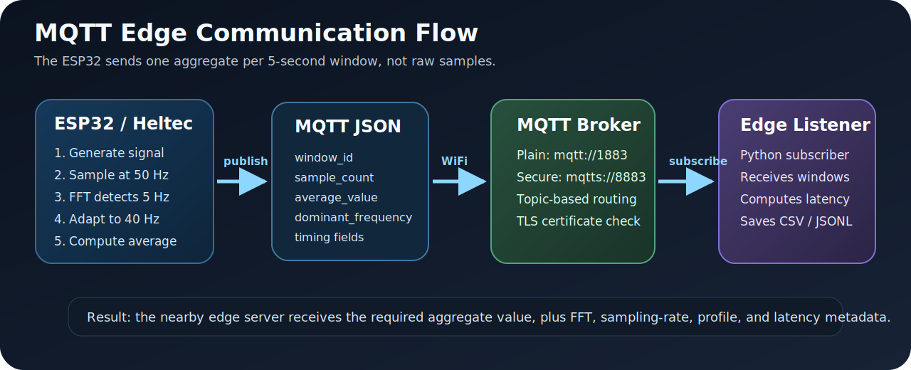

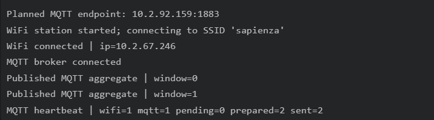

The ESP32 publishes JSON aggregate messages to:

```text
project/adaptive-sampling-node/aggregate
```

The Python edge listener records:

- receive timestamp
- raw JSON payload
- parsed latency fields
- CSV and JSONL logs
- Markdown summary

The important idea is that MQTT is used only after local processing is complete. The ESP32 does not send every raw sample over WiFi. It sends one compact aggregate per completed window, so the nearby edge server receives the value required by the assignment while the network traffic stays small and predictable.

### 5. LoRaWAN + TTN

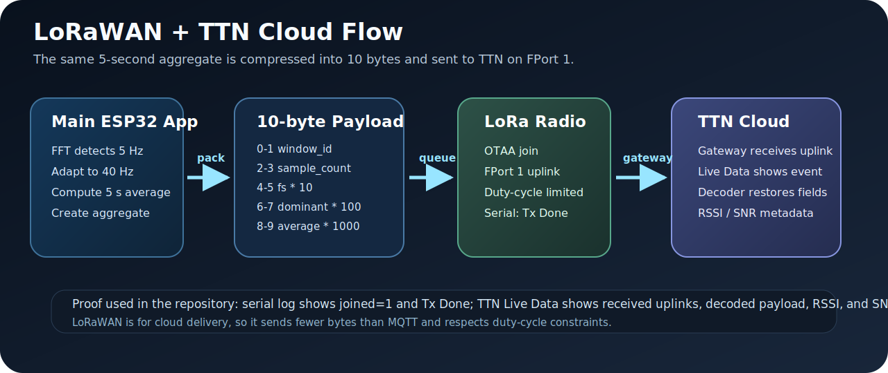

| Serial Join And TX | TTN Live Data |
| --- | --- |
| 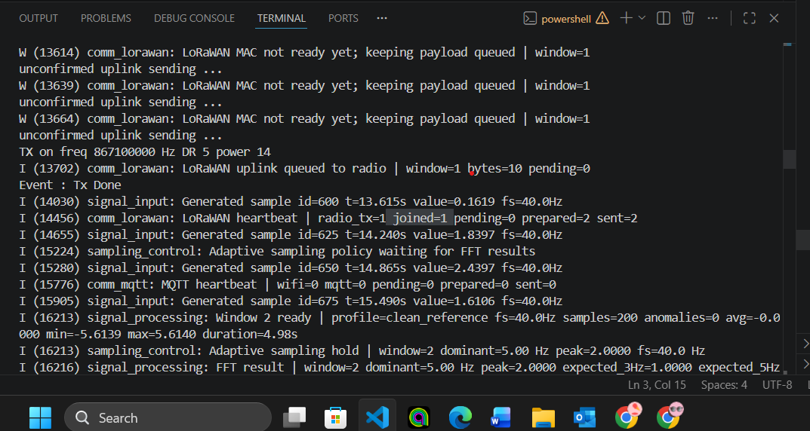 |  |

| TTN Decoded Payload | TTN Device Overview |
| --- | --- |
|  |  |

LoRaWAN is the cloud communication path. It is different from MQTT because it is low-power, long-range, and bandwidth-limited, so the firmware does not send a full JSON object. Instead, the same aggregate produced by the local pipeline is compressed into a compact `10-byte` binary payload and sent on `FPort 1`.

The current payload layout is:

| Bytes | Field | Encoding | Example meaning |
| --- | --- | --- | --- |
| `0-1` | `window_id` | unsigned 16-bit big-endian | which aggregate window was sent |
| `2-3` | `sample_count` | unsigned 16-bit big-endian | usually `200` after adapting to `40 Hz` for `5 s` |
| `4-5` | `sampling_frequency_hz * 10` | unsigned 16-bit big-endian | `40.0 Hz` becomes `400` |
| `6-7` | `dominant_frequency_hz * 100` | unsigned 16-bit big-endian | `5.00 Hz` becomes `500` |
| `8-9` | `average_value * 1000` | signed 16-bit big-endian | preserves the window average compactly |

The integrated main app was validated with a real TTN uplink and saved screenshots from the TTN console. The proof chain is:

1. The firmware prepares the LoRaWAN aggregate and logs `payload_hex`.
2. The Heltec LoRaWAN stack joins TTN with OTAA and logs `joined=1`.
3. The radio queues the uplink and logs `Event : Tx Done`.
4. TTN Live Data shows the uplink on the cloud side.
5. The TTN payload decoder reconstructs the aggregate fields from the `10-byte` payload.

Key evidence:

- [`source/results/lorawan_evidence_2026-04-20.md`](./source/results/lorawan_evidence_2026-04-20.md)
- [`source/cloud/ttn_payloads/README.md`](./source/cloud/ttn_payloads/README.md)
- [`source/cloud/ttn_payloads/ttn_decoder.js`](./source/cloud/ttn_payloads/ttn_decoder.js)
- [`source/pics/2026-04-20_serial_lorawan_join_tx.png`](./source/pics/2026-04-20_serial_lorawan_join_tx.png)
- [`source/pics/2026-04-20_ttn_live_data_uplink.png`](./source/pics/2026-04-20_ttn_live_data_uplink.png)

### 6. Signal Profiles


| Profile | Description |
| --- | --- |
| `clean_reference` | original `3 Hz + 5 Hz` signal |
| `noisy_reference` | signal plus Gaussian-like noise |
| `anomaly_stress` | noisy signal plus sparse injected spikes |

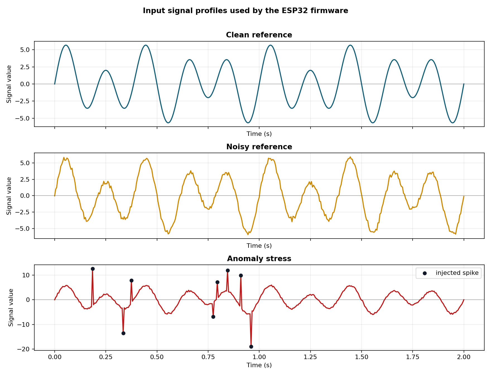

The anomaly evaluation also compares Z-score and Hampel filtering.

## Performance Evaluation

### Energy Consumption

The final INA219 measurement compares fixed baseline and adaptive mode using the same DUT, same monitor, same signal, same WiFi/MQTT workload, and same run duration.


| Metric | Baseline `50 Hz` | Adaptive `40 Hz` | Adaptive + deep sleep |
| --- | ---: | ---: | ---: |
| Average power | `553.0000 mW` | `552.6775 mW` | `410.8682 mW` |
| Integrated energy | `18.433238 mWh` | `18.422466 mWh` | `13.632451 mWh` |
| Delta vs baseline | reference | `-0.06%` | `-26.04%` |

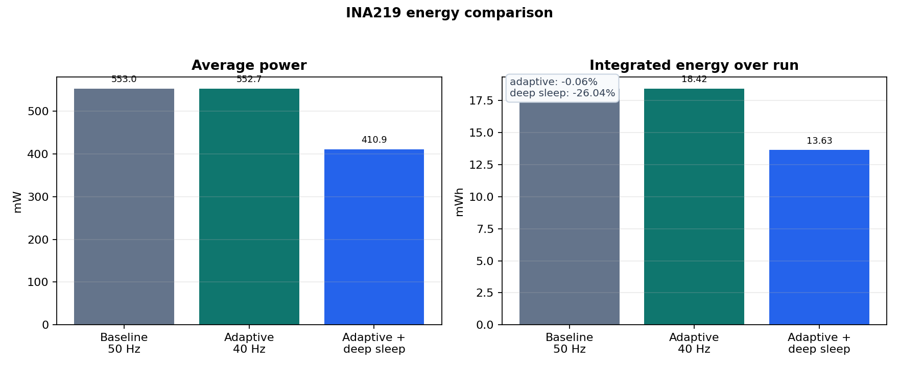

| Adaptive INA219 Trace | Deep-Sleep INA219 Trace |
| --- | --- |
|  |  |

Interpretation:

- Adaptive sampling reduced the local sample-processing rate from `50 Hz` to `40 Hz`.
- Awake average power changed only slightly because WiFi, display, MQTT, and always-on FreeRTOS tasks dominate the board power.
- Deep sleep is a separate low-power strategy and produces the larger reduction.

### Communication Volume

| Mode | Sampling rate | Samples represented | MQTT messages | Total payload |
| --- | ---: | ---: | ---: | ---: |
| Fixed baseline | `50 Hz` | `1250` | `5` | `2270 B` |
| Adaptive | `40 Hz` | `1000` | `5` | `2270 B` |

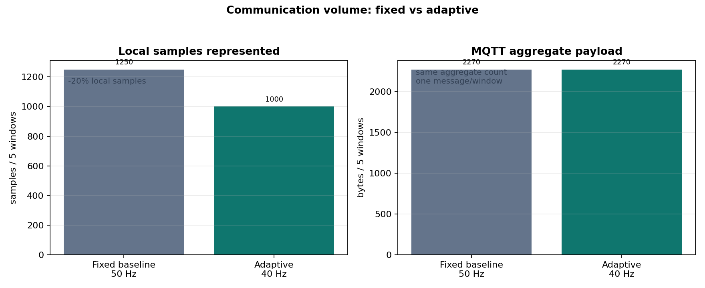

The represented local samples drop by `20%`, while MQTT bytes remain effectively constant because the system sends one aggregate per window.

### End-To-End Latency

The saved clean MQTT listener run recorded:

| Metric | Average |
| --- | ---: |
| listener latency | `1,234,421.6 us` |
| end-to-end latency | `1,587,868.6 us` |
| edge delay | `353,447.0 us` |

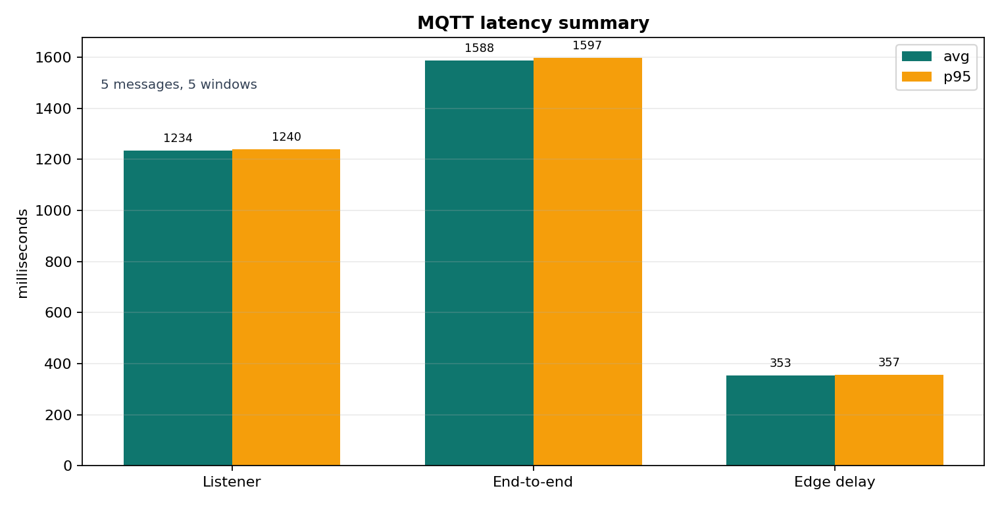

Evidence:

- [`source/results/summaries/mqtt_summary_2026-04-18_listener.md`](./source/results/summaries/mqtt_summary_2026-04-18_listener.md)

### Secure MQTT Validation

The secure MQTT rubric item was validated on `2026-04-22` with the real Heltec board publishing aggregate messages over `MQTTS` to a TLS broker:

| Secure Listener | Certificate Validation | ESP32 MQTT Heartbeat |
| --- | --- | --- |
| 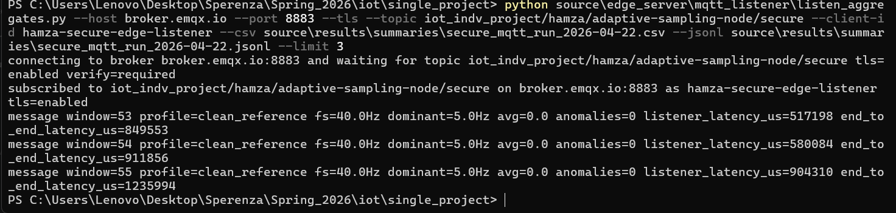 | 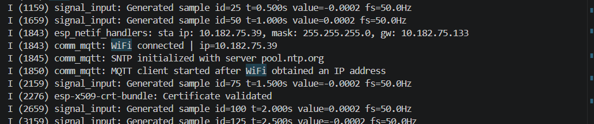 | 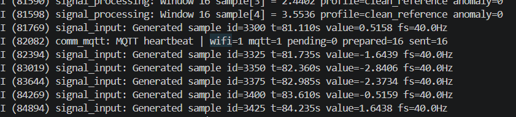 |

| Item | Value |
| --- | --- |
| Broker | `broker.emqx.io:8883` |
| Topic | `iot_indv_project/hamza/adaptive-sampling-node/secure` |
| Transport | `MQTTS` / TLS |
| Certificate verification | enabled on the ESP32 through the ESP-IDF certificate bundle |
| Listener verification | `tls=enabled verify=required` |
| Received windows | `9`, `10`, `11` with `0` missing windows |
| Average secure run payload size | `446.333 B` |
| Average secure run end-to-end latency | `907,561.667 us` |

Evidence:

- [`source/results/secure_mqtt_evidence_2026-04-22.md`](./source/results/secure_mqtt_evidence_2026-04-22.md)
- [`source/results/summaries/secure_mqtt_summary_final_2026-04-22.md`](./source/results/summaries/secure_mqtt_summary_final_2026-04-22.md)

### Bonus Anomaly Filters

The anomaly-filter evaluation covers:

- anomaly rates `p=1%, 5%, 10%`
- Z-score and Hampel filters
- true positive rate
- false positive rate
- mean-error reduction
- FFT dominant-frequency impact
- execution time
- estimated filter energy
- Hampel window-size tradeoff

Main artifact:

- [`source/results/summaries/anomaly_filter_evaluation_2026-04-21.md`](./source/results/summaries/anomaly_filter_evaluation_2026-04-21.md)

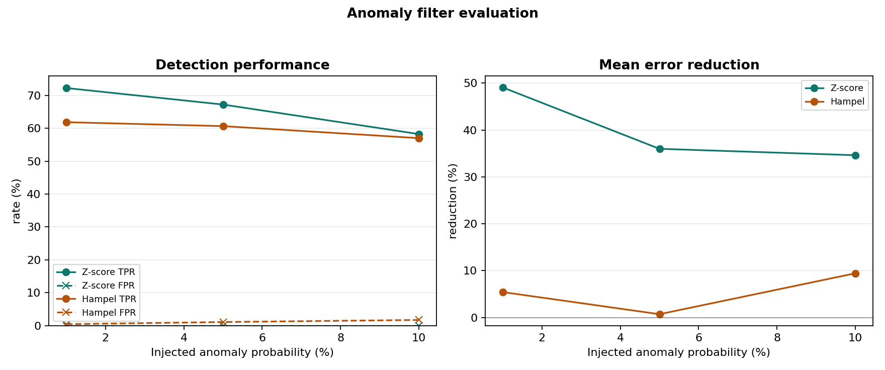

## Evidence Gallery

| Clean Input Signal | Three Signal Profiles |
| --- | --- |
|  |  |
| `3 Hz + 5 Hz` assignment input. | Bonus profiles before FFT and aggregation. |

| Raw Sampling Benchmark | Hardware Power Setup | Adaptive Pipeline | TTN Live Uplink |
| --- | --- | --- | --- |
|  |  |  |  |
| `199,126.59 Hz` raw benchmark. | Two-board INA219 measurement setup. | Live sampling, frequency, and aggregate visualization. | Cloud-side proof of LoRaWAN uplinks. |

| Adaptive Power | Deep-Sleep Power | TTN Decoded Payload | TTN Device Overview |
| --- | --- | --- | --- |
|  |  |  |  |
| Adaptive awake power run. | Optional deep-sleep power run. | Decoded TTN uplink metadata. | Device activity after main-app integration. |

| Energy Result Plot | Communication Plot | MQTT Latency Plot | Anomaly Filter Plot |
| --- | --- | --- | --- |
|  |  |  |  |
| Baseline vs adaptive vs deep sleep. | Local samples and aggregate bytes. | Average and p95 latency. | Detection and error reduction. |

| Secure MQTT Listener | TLS Certificate Validation | Heltec MQTT Heartbeat |
| --- | --- | --- |
|  |  |  |
| Secure listener received aggregate windows. | ESP-IDF certificate bundle validated the broker. | `wifi=1`, `mqtt=1`, and sent counter increasing. |

## Setup And Run

### 1. Clone

```powershell
git clone https://github.com/hamzaabedlkadr-b/iot_indv_project.git
cd iot_indv_project
```

### 2. Configure Local Secrets

Copy the local config template:

```powershell
copy source\firmware\esp32_node\include\project_config_local.example.h source\firmware\esp32_node\include\project_config_local.h
```

Edit `project_config_local.h` with WiFi, MQTT, and TTN values. This file is ignored by git.

### 3. Build Firmware

```powershell
pio run -d source\firmware\esp32_node -e heltec_wifi_lora_32_V3
```

### 4. Upload Firmware

```powershell
pio run -d source\firmware\esp32_node -e heltec_wifi_lora_32_V3 -t upload
```

### 5. Run Plain Edge Listener

```powershell
python -m pip install -r source\edge_server\mqtt_listener\requirements.txt
```

```powershell
python source\edge_server\mqtt_listener\listen_aggregates.py --host <BROKER_HOST> --port 1883 --topic project/adaptive-sampling-node/aggregate --csv source\results\summaries\latest_listener.csv --jsonl source\results\summaries\latest_listener.jsonl
```

### 6. Run Secure Edge Listener

```powershell
python source\edge_server\mqtt_listener\listen_aggregates.py --host broker.emqx.io --port 8883 --tls --topic iot_indv_project/hamza/adaptive-sampling-node/secure --client-id hamza-secure-edge-listener --csv source\results\summaries\secure_mqtt_run.csv --jsonl source\results\summaries\secure_mqtt_run.jsonl --limit 3
```

The important proof lines are:

```text
tls=enabled verify=required
Certificate validated
MQTT heartbeat | wifi=1 mqtt=1
```

### 7. Power Test Helper

For a second person rerunning the power test, use:

- [`source/docs/POWER_TEST_QUICKSTART_FOR_FRIEND.md`](./source/docs/POWER_TEST_QUICKSTART_FOR_FRIEND.md)

## How To Reproduce Key Claims

All local secrets should go in `source/firmware/esp32_node/include/project_config_local.h`. Do not edit secrets into the public `project_config.h`, and do not commit `project_config_local.h`.

| Claim | What to configure | What to run | What proof to look for |
| --- | --- | --- | --- |
| Raw maximum sampling frequency | `PROJECT_ENABLE_RAW_SAMPLING_BENCHMARK = 1` and normal communication disabled if desired | Flash the firmware and open serial monitor at `115200` | Log line like `Raw benchmark result ... achieved=199126.59Hz stable=yes` |
| Full adaptive pipeline | `PROJECT_ENABLE_RAW_SAMPLING_BENCHMARK = 0`, `PROJECT_ENABLE_ADAPTIVE_SAMPLING = 1`, `PROJECT_SIGNAL_PROFILE_CLEAN_REFERENCE` | Flash and monitor serial | `FFT result ... dominant=5.00 Hz`, then `Adaptive sampling update ... new_fs=40.0 Hz` |
| Fixed baseline for energy comparison | `PROJECT_ENABLE_ADAPTIVE_SAMPLING = 0` | Run DUT through the INA219 monitor | Baseline power summary in `source/results/summaries/ina219_baseline_2026-04-21.md` |
| Adaptive energy comparison | `PROJECT_ENABLE_ADAPTIVE_SAMPLING = 1` | Run DUT through the same INA219 monitor setup | Adaptive power summary in `source/results/summaries/ina219_adaptive_2026-04-21.md` |
| Deep-sleep energy comparison | `PROJECT_ENABLE_DEEP_SLEEP_EXPERIMENT = 1` in the private local config | Run DUT through INA219 and capture the lower-power trace | Deep-sleep summary in `source/results/summaries/ina219_deepsleep_2026-04-21.md` |
| Plain MQTT edge delivery | Set WiFi, broker host/port, and `PROJECT_MQTT_SECURITY_PLAINTEXT` | Run the Python listener and flash the DUT | Listener receives consecutive `window_id` values with no missing windows |
| Secure MQTT delivery | Set broker `broker.emqx.io`, port `8883`, and `PROJECT_MQTT_SECURITY_TLS` | Run the listener with `--tls`; flash the DUT | `tls=enabled verify=required`, `Certificate validated`, and `mqtt=1` heartbeat |
| LoRaWAN / TTN delivery | Enable `PROJECT_LORAWAN_ENABLE_RADIO_TX = 1` and put TTN keys in local config | Flash near gateway coverage and watch TTN Live Data | Serial `Tx Done` plus TTN uplink screenshots |
| Three signal profiles | Change `PROJECT_SIGNAL_PROFILE` between clean, noisy, and anomaly modes | Run MQTT listener for each profile | Profile summaries and anomaly counts in `source/results/summaries/` |

Most useful serial lines during a live demo:

```text
Raw benchmark result
FFT result | window=... dominant=5.00 Hz
Adaptive sampling update | previous_fs=50.0 Hz new_fs=40.0 Hz
Prepared MQTT aggregate payload
MQTT heartbeat | wifi=1 mqtt=1
LoRaWAN heartbeat | radio_tx=1 joined=1
TX on freq ...
Event : Tx Done
```

## Presentation Walkthrough

Use this order during the workshop or presentation:

- Start with the assignment goal: one ESP32 node samples a signal, computes FFT locally, adapts the sampling rate, aggregates a `5 s` window, and communicates the aggregate to edge and cloud.
- Show the input equation and the clean waveform image, then explain the three profiles: `clean_reference`, `noisy_reference`, and `anomaly_stress`.
- Show the maximum sampling benchmark: raw throughput `199,126.59 Hz`, while the full application uses a conservative `50 Hz` fixed baseline.
- Show the FFT result: the dominant component is `5 Hz`, so the adaptive policy changes from `50 Hz` to `40 Hz`.
- Show the aggregate fields: `window_id`, `sample_count`, `average_value`, `dominant_frequency_hz`, and timing fields.
- Show MQTT edge delivery, then secure MQTT proof with `tls=enabled verify=required` and `Certificate validated`.
- Show LoRaWAN/TTN proof: serial radio activity plus TTN Live Data and decoded uplink screenshots.
- Show the performance tables: energy, communication volume, and latency.
- Show the bonus work: three input signals and the Z-score/Hampel anomaly-filter evaluation.
- Close with the key engineering lesson: adaptive sampling reduces local sample work, but WiFi/display/runtime dominate awake board power, so deep sleep is needed for large energy savings.

Main evidence map:

- [`source/results/final_evidence_index_2026-04-21.md`](./source/results/final_evidence_index_2026-04-21.md)
- [`source/docs/GRADING_EVIDENCE_MATRIX.md`](./source/docs/GRADING_EVIDENCE_MATRIX.md)

## Likely Evaluation Questions

| Question | Short answer |
| --- | --- |
| Is the input really a sensor? | The project uses a virtual sensor because the assignment explicitly defines a mathematical input signal. The firmware generates that signal in real time, samples it through the same FreeRTOS pipeline, and treats it as the sensor source. |
| Why are there two sampling-frequency numbers? | `199,126.59 Hz` is the raw sample-generation benchmark. `50 Hz` is the conservative full-pipeline baseline with FFT, queues, MQTT, LoRaWAN, metrics, and display enabled. |
| Why is adaptive sampling `40 Hz` instead of `10 Hz` for a `5 Hz` signal? | `10 Hz` is the theoretical Nyquist minimum. The implemented policy uses `8x` the dominant frequency to keep stable FFT windows and scheduling margin on the real board. |
| What is the aggregate? | It is the average value over a `5 s` window, plus metadata such as `window_id`, `sample_count`, `sampling_frequency_hz`, `dominant_frequency_hz`, `signal_profile`, and timing fields. |
| Did adaptive sampling reduce communication volume? | It reduced represented local samples by `20%` over the same five-window period. MQTT payload bytes stay flat because the design already sends one aggregate per window, not raw samples. |
| Why is awake energy saving only `-0.06%`? | The ESP32 was still awake with WiFi, display, MQTT, FreeRTOS tasks, and radio support. Those dominate power more than the small reduction from `50 Hz` to `40 Hz` sampling. |
| Why include deep sleep if adaptive awake savings are small? | Deep sleep shows what is required for meaningful battery savings. It is reported separately because it changes the duty cycle, while the main adaptive comparison keeps the board awake. |
| How is MQTT secure? | The secure run used `MQTTS` on port `8883`, the listener required TLS verification, and the ESP32 log showed certificate validation through the ESP-IDF certificate bundle. |
| How is LoRaWAN proven? | The repo includes serial logs/screenshots showing join and transmit activity plus TTN Live Data and decoded uplink screenshots for the same Heltec node. |
| Why does LoRaWAN use only 10 bytes? | LoRaWAN has small payloads and duty-cycle limits, so the firmware sends only the important aggregate fields in binary form instead of sending a long JSON message. |
| What is `FPort 1`? | It is the application port used by TTN to route/decode the payload. Our TTN decoder expects the `10-byte` aggregate payload on `FPort 1`. |
| What does `joined=1` prove? | It proves the node completed the LoRaWAN OTAA join and is allowed to send uplinks to the TTN network. |
| What does `Tx Done` prove? | It proves the Heltec radio stack accepted and transmitted an uplink packet. The TTN screenshots then prove that the cloud received it. |
| What should be shown first in class? | Show the README coverage table, then raw max frequency, adaptive FFT result, MQTT/secure MQTT evidence, TTN evidence, energy/communication/latency plots, and finally the anomaly-filter bonus. |

## Submission Notes

- Local secrets are kept out of git through `project_config_local.h`.
- Build outputs, PlatformIO cache, local logs, and scratch test folders are ignored.
- The main evidence map is [`source/results/final_evidence_index_2026-04-21.md`](./source/results/final_evidence_index_2026-04-21.md).
- The grading matrix is [`source/docs/GRADING_EVIDENCE_MATRIX.md`](./source/docs/GRADING_EVIDENCE_MATRIX.md).
