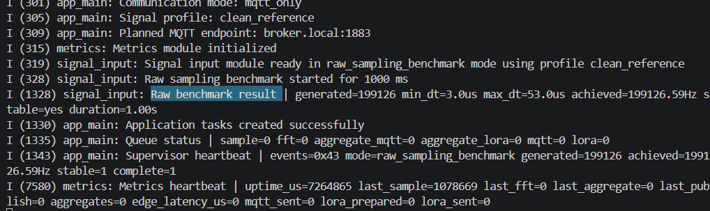
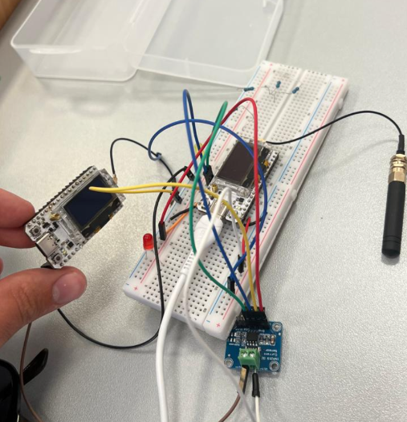
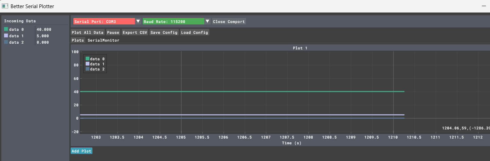
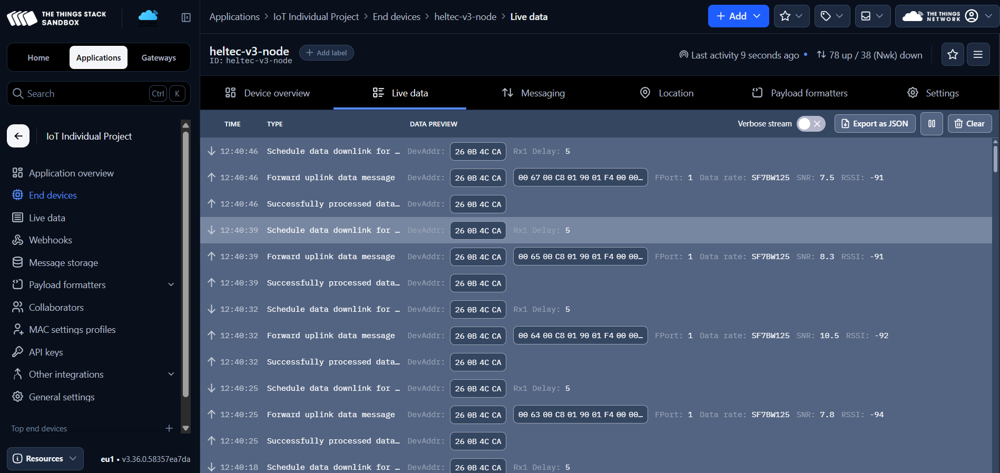
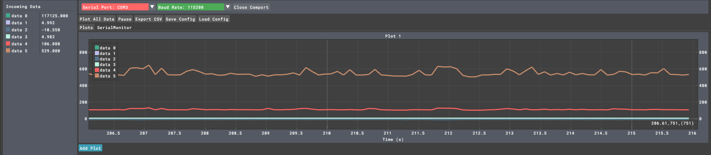
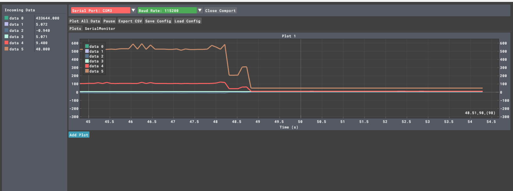
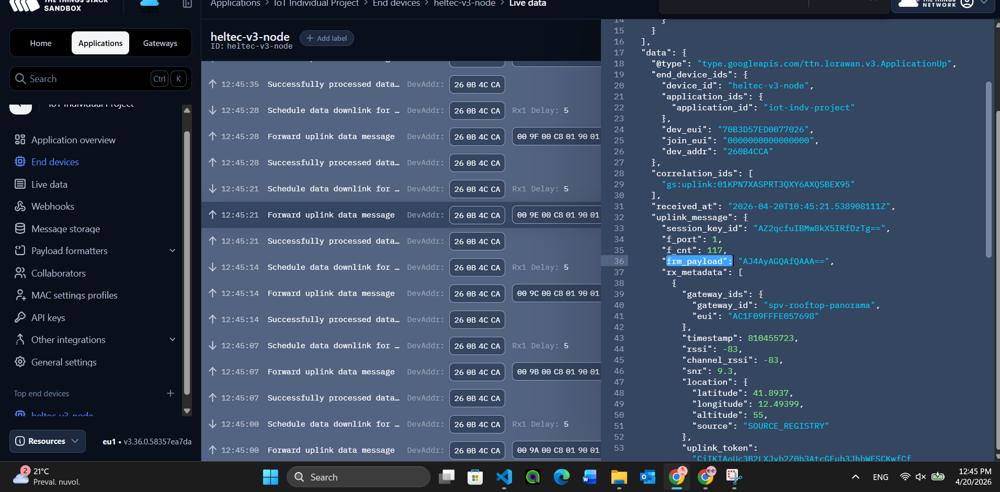
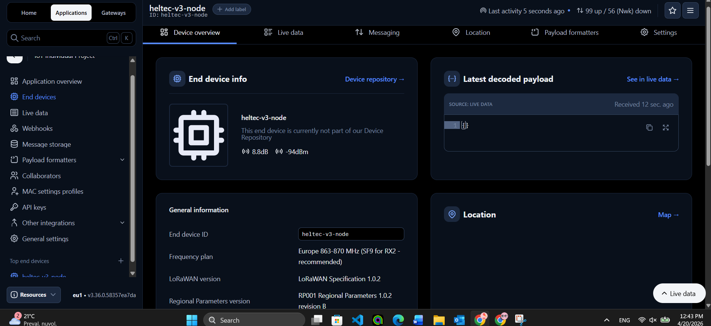

# ESP32 Adaptive Sampling IoT Assignment

This repository contains an `ESP32 + FreeRTOS` implementation of the individual IoT assignment: generate a virtual sensor signal, estimate its dominant frequency with an `FFT`, adapt the sampling rate, compute a windowed aggregate, publish that aggregate to a nearby edge server over `MQTT/WiFi`, and send the same aggregate over `LoRaWAN + TTN`.

The technical project files live under [`source/`](./source/). The repository root is intentionally kept lightweight so the public submission looks clean and focused.

## Status Snapshot

| Assignment area | Current status | Main evidence |
| --- | --- | --- |
| Maximum sampling frequency | Raw benchmark measured `199,126.59 Hz`; strict full-pipeline baseline remains `50 Hz` | [`source/pics/Sampling_frequency.png`](./source/pics/Sampling_frequency.png), [`source/docs/CURRENT_PROGRESS_REPORT.md`](./source/docs/CURRENT_PROGRESS_REPORT.md) |
| FFT-based adaptive sampling | Validated (`50 Hz -> 40 Hz`) | [`source/README.md`](./source/README.md) |
| Aggregate over a `5 s` window | Validated | [`source/README.md`](./source/README.md) |
| MQTT over WiFi to edge server | Validated on real hardware, including a fresh WiFi run after the network change | [`source/results/mqtt_evidence_2026-04-18.md`](./source/results/mqtt_evidence_2026-04-18.md), [`source/results/wifi_mqtt_evidence_2026-04-21.md`](./source/results/wifi_mqtt_evidence_2026-04-21.md) |
| Three input signals bonus | Validated for `clean_reference`, `noisy_reference`, and `anomaly_stress` | [`source/results/final_evidence_index_2026-04-21.md`](./source/results/final_evidence_index_2026-04-21.md), [`source/results/summaries/signal_profile_comparison_2026-04-18.txt`](./source/results/summaries/signal_profile_comparison_2026-04-18.txt) |
| Anomaly filters bonus | Evaluated with `Z-score` and `Hampel` filters at `p=1%, 5%, 10%` | [`source/results/summaries/anomaly_filter_evaluation_2026-04-21.md`](./source/results/summaries/anomaly_filter_evaluation_2026-04-21.md) |
| LoRaWAN + TTN cloud path | Validated on real hardware with the integrated main app; serial and `TTN` screenshots are saved in the repo | [`source/results/lorawan_evidence_2026-04-20.md`](./source/results/lorawan_evidence_2026-04-20.md) |
| Communication volume | Baseline-vs-adaptive table completed; aggregate MQTT bytes stay flat while represented samples drop `20%` | [`source/results/summaries/communication_volume_comparison_2026-04-21.md`](./source/results/summaries/communication_volume_comparison_2026-04-21.md) |
| Energy comparison | INA219 two-board baseline/adaptive measurement completed; adaptive saved `0.06%` energy, and optional deep sleep saved `26.04%` | [`source/results/summaries/ina219_comparison_2026-04-21.md`](./source/results/summaries/ina219_comparison_2026-04-21.md), [`source/results/summaries/ina219_three_mode_comparison_2026-04-21.md`](./source/results/summaries/ina219_three_mode_comparison_2026-04-21.md) |
| Secure MQTT | TLS-capable firmware path implemented, live proof still pending | [`source/docs/SECURE_MQTT_SETUP.md`](./source/docs/SECURE_MQTT_SETUP.md) |

## Start Here

- Main technical walkthrough: [`source/README.md`](./source/README.md)
- Assignment requirements and project framing: [`source/PROJECT_REQUIREMENTS.md`](./source/PROJECT_REQUIREMENTS.md)
- Clean assignment brief summary: [`source/ASSIGNMENT_BRIEF.md`](./source/ASSIGNMENT_BRIEF.md)
- Submission snapshot: [`source/docs/SUBMISSION_SNAPSHOT.md`](./source/docs/SUBMISSION_SNAPSHOT.md)
- Evidence map: [`source/docs/GRADING_EVIDENCE_MATRIX.md`](./source/docs/GRADING_EVIDENCE_MATRIX.md)
- Current progress report: [`source/docs/CURRENT_PROGRESS_REPORT.md`](./source/docs/CURRENT_PROGRESS_REPORT.md)
- Final evidence index: [`source/results/final_evidence_index_2026-04-21.md`](./source/results/final_evidence_index_2026-04-21.md)
- Firmware guide: [`source/firmware/esp32_node/README.md`](./source/firmware/esp32_node/README.md)
- Edge listener guide: [`source/edge_server/mqtt_listener/README.md`](./source/edge_server/mqtt_listener/README.md)
- Fresh WiFi/MQTT evidence bundle: [`source/results/wifi_mqtt_evidence_2026-04-21.md`](./source/results/wifi_mqtt_evidence_2026-04-21.md)
- LoRaWAN evidence bundle: [`source/results/lorawan_evidence_2026-04-20.md`](./source/results/lorawan_evidence_2026-04-20.md)

## Evidence Gallery

| Raw Sampling Benchmark | Hardware Power Setup | Adaptive Pipeline | TTN Live Uplink |
| --- | --- | --- | --- |
|  |  |  |  |
| Raw class-style maximum sampling benchmark measured at `199,126.59 Hz`. | Hardware proof for the two-board `INA219` energy-measurement setup. | Live visualization of sampling frequency, dominant frequency, and aggregate average. | Cloud-side proof that the compact `FPort 1` aggregate uplink reached `TTN`. |

| Adaptive Power | Deep-Sleep Power | TTN Decoded Payload | TTN Device Overview |
| --- | --- | --- | --- |
|  |  |  |  |
| Adaptive awake run used for the direct `50 Hz` vs `40 Hz` comparison. | Optional low-power duty-cycle experiment showing a drop to about `48 mW`. | Cloud-side decoded aggregate evidence from `TTN`. | Device page showing recent activity and repeated uplink visibility after the main-app integration. |

## Repository Layout

```text
source/
  firmware/esp32_node/        ESP32 FreeRTOS firmware
  edge_server/mqtt_listener/  local MQTT listener and logger
  cloud/ttn_payloads/         TTN decoder and cloud notes
  docs/                       runbooks, evidence matrix, reports
  results/                    saved measurements and summaries
  pics/                       screenshots used in the write-up
```

## Quick Run

### 1. Configure local credentials without committing them

Copy:

- [`source/firmware/esp32_node/include/project_config_local.example.h`](./source/firmware/esp32_node/include/project_config_local.example.h)

to:

- `source/firmware/esp32_node/include/project_config_local.h`

and set your local WiFi and broker values there. The real override file is ignored by git.

### 2. Install the edge-listener dependency

```powershell
python -m pip install -r source/edge_server/mqtt_listener/requirements.txt
```

### 3. Build and flash the firmware

```powershell
pio run -d source/firmware/esp32_node
pio run -d source/firmware/esp32_node -t upload
```

### 4. Run the local MQTT listener

```powershell
python source/edge_server/mqtt_listener/listen_aggregates.py --host <BROKER_HOST> --port 1883 --topic project/adaptive-sampling-node/aggregate --csv source/results/summaries/latest_listener.csv --jsonl source/results/summaries/latest_listener.jsonl
```

## Professional-Repo Notes

- Live secrets were removed from the committed firmware config.
- Build output, Python cache files, local logs, and workspace-only tooling are ignored.
- The README now includes direct visual proof for the adaptive pipeline and the integrated `LoRaWAN/TTN` path.
- The documentation states clearly what is already validated and what is still pending, so the repository does not overclaim.

## Remaining Final-Submission Work

- save one live `MQTTS` validation run
